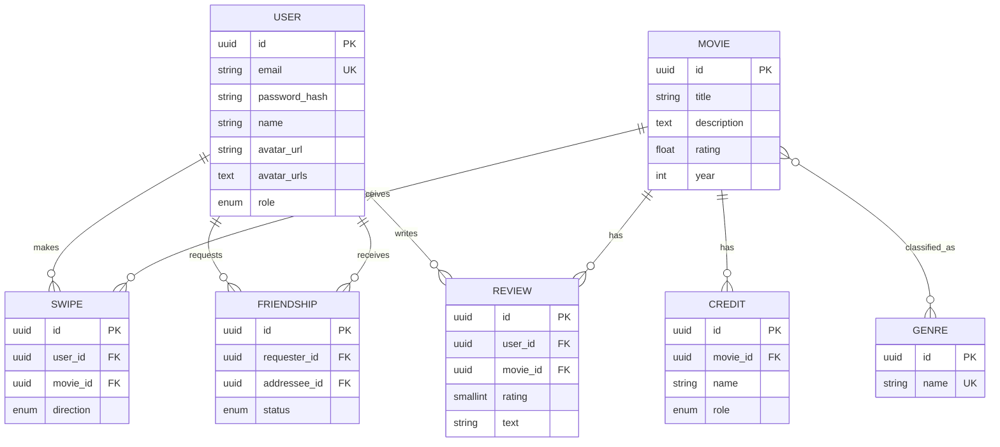

# Film Tinder

Полноценное приложение для выбора фильмов: React 19 frontend и NestJS backend в одном репозитории.  

**Развёрнутое приложение:** <https://film-tinder.onrender.com>

- приложение: <https://film-tinder.onrender.com>
- Swagger/OpenAPI: <https://film-tinder.onrender.com/api/docs>
- GraphQL Sandbox: <https://film-tinder.onrender.com/graphql>

## Возможности

- **Свайп-лента** — like / dislike / «посмотреть позже»; уже просмотренные фильмы скрываются, порядок задаётся персональными рекомендациями.
- **Персональные рекомендации** (вкладка «Для вас» и порядок ленты) — скоринг по жанрам ваших лайков + лайкам друзей + рейтингу (эвристика, без ML; см. `MoviesService.recommendations`). Для гостя — baseline по рейтингу.
- **Поиск и фильтры каталога** — по названию, жанру и диапазону лет.
- **Отзывы и пользовательский рейтинг** на странице фильма — 1–5★ + короткая рецензия, средняя «оценка зрителей», один отзыв на пользователя (редактируемый).
- **Друзья** — заявки (отправить / принять / отклонить / отменить / удалить), **SSE-уведомления** о новых заявках, просмотр лайков друга и **мэтчи** (общие лайки).
- **Кино-вечер на двоих** — комната по коду: оба свайпают, при взаимном лайке мэтч приходит обоим в реальном времени (SSE).
- **История свайпов** — списки «Нравится» / «Дизлайки» / «Посмотреть позже» с отменой свайпа.
- **Профиль** — аватар с историей (карусель выбора и удаление, освобождение места в S3), смена имени / email / пароля.
- **Админ** — MVC-панель CRUD фильмов, роль `admin`.

## Быстрый запуск

Требования: Node.js 22, pnpm и Docker.

```bash
cp .env.example .env
docker compose up -d postgres supertokens
pnpm install
pnpm build
pnpm start
```

`docker compose` поднимает PostgreSQL и **SuperTokens Core** (self-hosted, `http://localhost:3567`) — это сервер аутентификации. Учётными данными и сессиями управляет SuperTokens; приложение хранит лишь доменный профиль.

После первого запуска миграция создаст схему, а idempotent seed зарегистрирует в SuperTokens и добавит в базу две учётные записи:

- пользователь: `user@film-tinder.local` / `User12345!`;
- администратор: `admin@film-tinder.local` / `ChangeMe123!` (значения меняются через `ADMIN_EMAIL` и `ADMIN_PASSWORD`).

Открыть:

- приложение: <http://localhost:3000>;
- Swagger/OpenAPI: <http://localhost:3000/api/docs>;
- GraphQL Sandbox: <http://localhost:3000/graphql>;
- MVC-панель администратора: <http://localhost:3000/admin/movies>.

Для разработки frontend и backend можно запустить в двух терминалах:

```bash
pnpm start:dev
pnpm dev
```

Vite работает на `5173` и проксирует `/api`, `/auth`, `/graphql`, `/uploads` на NestJS (`3000`).

## Реализация

1. NestJS читает `PORT`, отдаёт production-сборку React и Handlebars MVC-представления с partials для header/menu/session/content/footer/movie card. Добавлен `render.yaml`.
2. PostgreSQL + TypeORM, автоматическая миграция и шесть связанных сущностей. Исходные данные не перезаписываются; seed выполняется только для пустого каталога.
3. MVC CRUD фильмов и SSE `/api/movies/events`; изменения каталога отображаются в админ-панели и на главной странице.
4. REST CRUD, DTO-валидация, единый exception filter, пагинация и `Link`, Swagger с auth-схемами.
5. Code-first GraphQL: запросы, предметные мутации, nested field resolvers, пагинация и лимит сложности 100.
6. `X-Elapsed-Time`, серверный in-memory cache каталога, `ETag` + `Cache-Control`, загрузка аватара в S3-compatible storage или локально в development.
7. Аутентификация и авторизация на **SuperTokens**: динамический `AuthModule.forRootAsync` (конфигурация из env инициализирует SDK), рецепты EmailPassword + Session + UserRoles + UserMetadata, глобальный `AuthGuard` (`Session.getSession`) + `RolesGuard`, декоратор `@Public()` (роль `@PublicAccess` из методички), middleware SuperTokens на `/auth/*` и redirect-middleware для MVC-панели, роли `user`/`admin`, cookie-схема в Swagger, связывание `userId` SuperTokens с доменным профилем. Регистрация/вход/выход обслуживает SuperTokens (`/auth/signup`, `/auth/signin`, `/auth/signout`).

## Доменная модель



Исходник диаграммы также лежит в [`docs/er-diagram.mmd`](docs/er-diagram.mmd).

Дополнительно миграциями добавлены: значение `watch_later` в enum `swipe_direction`, колонка `users.avatar_urls` (история аватаров) и таблица `reviews`. Комнаты кино-вечера — эфемерные, хранятся в памяти процесса (без таблицы).

## API

Главные группы маршрутов:

- `/auth/*` — маршруты SuperTokens: `signup`, `signin`, `signout`, `session/refresh` и др.;
- `/api/auth` — текущий пользователь сессии (`me`, `session`);
- `/api/movies` — каталог с фильтрами (`search`, `genre`, `yearFrom`, `yearTo`), CRUD, `deck` (персональная лента), `recommendations`, `random`, свайпы и их отмена, SSE каталога, отзывы `/:id/reviews`;
- `/api/genres` — справочник жанров;
- `/api/users` — профиль, пароль, аватар (загрузка / выбор / удаление из истории), друзья (заявки / принять / удалить), списки `me/likes` · `me/dislikes` · `me/watchlist`, лайки друга `/:id/likes` и мэтчи `/:id/matches`, SSE-уведомления `me/notifications`;
- `/api/rooms` — кино-вечер на двоих: создание, вход по коду, свайпы и SSE мэтчей;
- `/graphql` — эквивалентные операции над фильмами, свайпами и рекомендациями.

Полные request/response schemas и коды ответов доступны в Swagger. Примеры запросов есть в [`requests.http`](requests.http).

## Объектное хранилище

Если заданы `S3_ENDPOINT`, `S3_BUCKET`, `S3_ACCESS_KEY_ID`, `S3_SECRET_ACCESS_KEY` и `S3_PUBLIC_URL`, аватары загружаются через AWS SDK в Yandex Object Storage или другой S3-compatible сервис. Без этих переменных development-режим сохраняет файлы в `public/uploads/avatars`; это fallback для локального запуска, а не production-хранилище.

Каждая загрузка добавляет аватар в историю пользователя (`avatar_urls`) — в профиле можно выбрать прежний аватар или удалить ненужный; удаление стирает объект и из S3 (или локального диска), не оставляя «висящих» файлов.

## Проверки

```bash
pnpm lint
pnpm test
pnpm build
```

PostgreSQL smoke test: после запуска проверить `/api/health`, залогиниться, получить каталог, записать свайп и открыть `/graphql`. Примеры подготовлены в `requests.http`.

## Ограничения

- Для production используйте Managed SuperTokens Core (`SUPERTOKENS_CONNECTION_URI` + `SUPERTOKENS_API_KEY`) и обязательно смените пароль администратора (`ADMIN_PASSWORD`).
- Рекомендации — прозрачная эвристика (жанры лайков + лайки друзей + рейтинг), не ML-рекомендер.
- Комнаты кино-вечера хранятся в памяти процесса: не переживают перезапуск/передеплой и работают в рамках одного инстанса (для сценария «на вечер» этого достаточно).
- Для production-загрузок требуется внешний S3 bucket; локальный fallback на Render не персистентен.
- Автоматический deploy создан как Blueprint, но URL сервиса нужно заменить на фактический Render hostname в `CORS_ORIGIN`.
