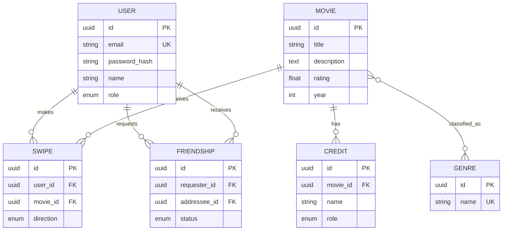

# Film Tinder

Полноценное приложение для выбора фильмов: React 19 frontend и NestJS backend в одном репозитории.  

**Развёрнутое приложение:** <https://film-tinder.onrender.com>

- приложение: <https://film-tinder.onrender.com>
- Swagger/OpenAPI: <https://film-tinder.onrender.com/api/docs>
- GraphQL Sandbox: <https://film-tinder.onrender.com/graphql>

## Быстрый запуск

Требования: Node.js 22, pnpm и Docker.

```bash
cp .env.example .env
docker compose up -d postgres
pnpm install
pnpm build
pnpm start
```

После первого запуска миграция создаст схему, а idempotent seed добавит стартовый каталог и две учётные записи:

- пользователь: `user@film-tinder.local` / `User12345!`;
- администратор: `admin@film-tinder.local` / `ChangeMe123!` (значения меняются через `ADMIN_EMAIL` и `ADMIN_PASSWORD`).

Открыть:

- приложение: <http://localhost:3000>;
- Swagger/OpenAPI: <http://localhost:3000/api/docs>;
- GraphQL Sandbox: <http://localhost:3000/graphql>;
- MVC-панель администратора: <http://localhost:3000/admin/movies>.

Для разработки frontend и backend можно запустить в двух терминалах:

```bash
pnpm start:dev
pnpm dev
```

Vite работает на `5173` и проксирует `/api`, `/graphql`, `/uploads` на NestJS (`3000`).

## Что реализовано по лабораторным

1. NestJS читает `PORT`, отдаёт production-сборку React и Handlebars MVC-представления с partials для header/menu/session/content/footer/movie card. Добавлен `render.yaml`.
2. PostgreSQL + TypeORM, автоматическая миграция и шесть связанных сущностей. Исходные данные не перезаписываются; seed выполняется только для пустого каталога.
3. MVC CRUD фильмов и SSE `/api/movies/events`; изменения каталога отображаются в админ-панели и на главной странице.
4. REST CRUD, DTO-валидация, единый exception filter, пагинация и `Link`, Swagger с auth-схемами.
5. Code-first GraphQL: запросы, предметные мутации, nested field resolvers, пагинация и лимит сложности 100.
6. `X-Elapsed-Time`, серверный in-memory cache каталога, `ETag` + `Cache-Control`, загрузка аватара в S3-compatible storage или локально в development.
7. Динамический `AuthModule`, JWT в HttpOnly cookie или Bearer header, глобальные auth/role guards, redirect middleware для MVC, роли `user` и `admin`, регистрация/вход/выход и профиль.

## Доменная модель



Исходник диаграммы также лежит в [`docs/er-diagram.mmd`](docs/er-diagram.mmd).

## API

Главные группы маршрутов:

- `/api/auth` — регистрация, вход, выход, текущая сессия;
- `/api/movies` — каталог, CRUD, random/recommendations, свайпы и SSE;
- `/api/genres` — справочник жанров;
- `/api/users` — профиль, пароль, аватар, друзья, список пользователей для admin;
- `/graphql` — эквивалентные операции над фильмами и свайпами.

Полные request/response schemas и коды ответов доступны в Swagger. Примеры запросов есть в [`requests.http`](requests.http).

## Объектное хранилище

Если заданы `S3_ENDPOINT`, `S3_BUCKET`, `S3_ACCESS_KEY_ID`, `S3_SECRET_ACCESS_KEY` и `S3_PUBLIC_URL`, аватары загружаются через AWS SDK в Yandex Object Storage или другой S3-compatible сервис. Без этих переменных development-режим сохраняет файлы в `public/uploads/avatars`; это fallback для локального запуска, а не production-хранилище.

## Проверки

```bash
pnpm lint
pnpm test
pnpm build
```

PostgreSQL smoke test: после запуска проверить `/api/health`, залогиниться, получить каталог, записать свайп и открыть `/graphql`. Примеры подготовлены в `requests.http`.

## Ограничения

- Для production обязательно заменить `JWT_SECRET` и пароль администратора.
- Встроенные рекомендации — прозрачный baseline: непросмотренные фильмы ранжируются по рейтингу. Это не ML-рекомендер.
- Для production-загрузок требуется внешний S3 bucket; локальный fallback на Render не персистентен.
- Автоматический deploy создан как Blueprint, но URL сервиса нужно заменить на фактический Render hostname в `CORS_ORIGIN`.
